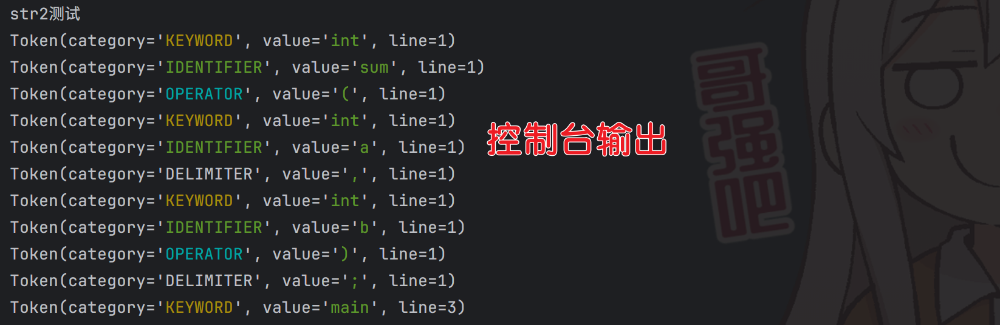
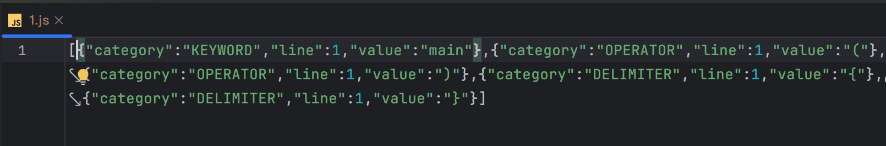
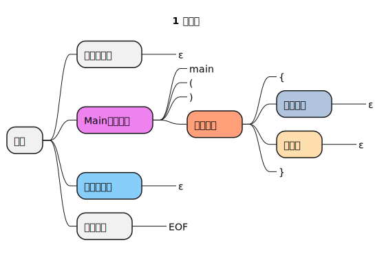
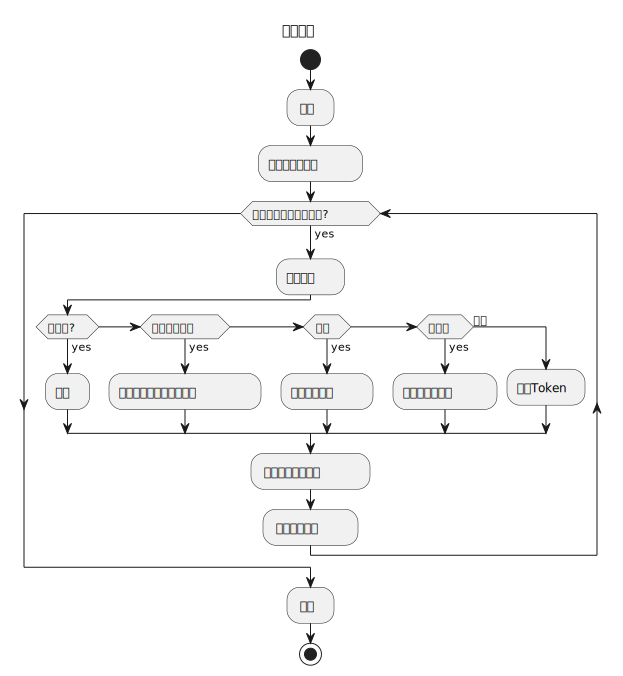
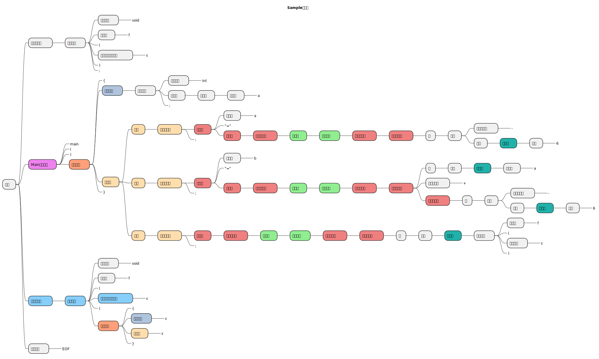
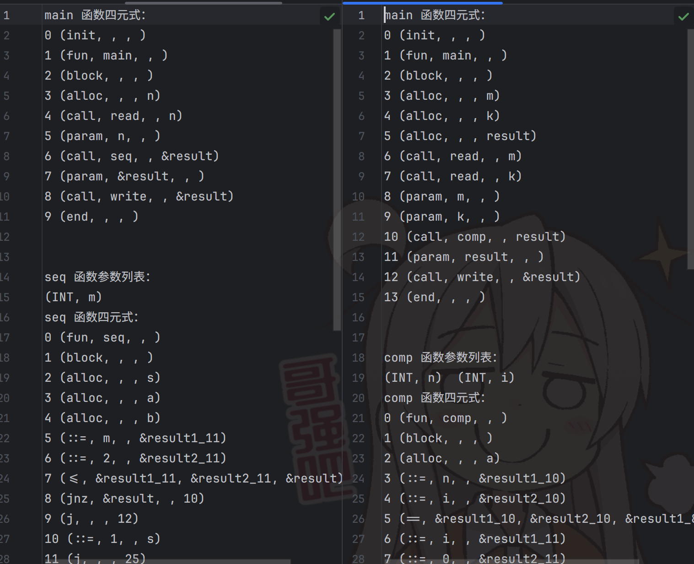

# Sample语言的词法分析，语法分析器

> 实现Sample语言的分析
> 
> 所引用到的库：`fastjson 2`, `PlantUML`, `jetbrains.kotlinx.coroutines.core`
> 
> 分别用于解析json，生成UML图，协程

java版本：1.8及其以上。

> [!NOTE]
> 关于gui版可见我另一个仓库：（即将发布）
> 
> javaer 可以运行[`Main`类](src/Main.java)，会kotlin的人可以查看 [文件测试.kt](src/文件测试.kt)

## 生成案例

- 词法分析

- 语法分析

## 词法分析

## 语法分析

生成树示例

## 四元式生成

