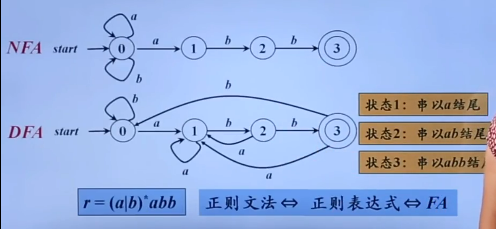

此为DFA实现

```kotlin
import State.* // 导入状态枚举

// 实现表达式 r = (a|b)*abb
// 这个函数接收一个字符串，然后使用状态机检查它是否符合模式
fun expressionImpl(str: String): Boolean {
    // 创建一个新的状态机实例
    val stateMachine = StateMachine()
    // 遍历字符串中的每个字符
    for (char in str) {
        // 将字符输入到状态机中，状态机会根据输入改变状态
        stateMachine.move(char)
    }
    // 如果状态机的最终状态是 Stat3，那么字符串符合模式
    return (stateMachine.state == Stat3)
}

// 状态机类
class StateMachine {
    // 初始状态是 Stat0
    var state = Stat0

    // move 方法接收一个字符，并根据当前状态和输入的字符改变状态
    fun move(char: Char) {
        // 如果字符不是 'a' 或 'b'，抛出异常
        if (char != 'a' && char != 'b') {
            throw IllegalArgumentException("char must be a or b")
        }
        // 根据当前状态和输入的字符改变状态
        when (state) {
            Stat0 -> {
                state = if (char == 'a') {
                    Stat1
                } else {
                    Stat0
                }
            }

            Stat1 -> {
                state = if (char == 'a') {
                    Stat1
                } else {
                    Stat2
                }
            }

            Stat2 -> {
                state = if (char == 'a') {
                    Stat1
                } else {
                    Stat3
                }
            }

            Stat3 -> {
                state = if (char == 'a') {
                    Stat1
                } else {
                    Stat0
                }
            }
        }
    }
}

// 状态枚举，包含四种状态
enum class State {
    Stat0, Stat1, Stat2, Stat3;
}

// 测试用例
fun main() {
    // 创建一个包含多个测试字符串的列表
    val testStrings = listOf(
        "abb",
        "aabb",
        "ababb",
        "abababb",
        "ababababb",
        "abababababb",
        "ababababababb",
        "abababababababb",
        "ababababababababb"
    )
    // 遍历测试字符串
    for (str in testStrings) {
        // 打印字符串和它是否符合模式的结果
        println("$str: ${expressionImpl(str)}")
    }
}
```
